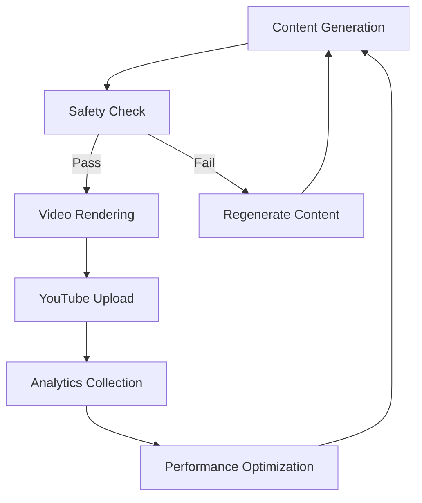
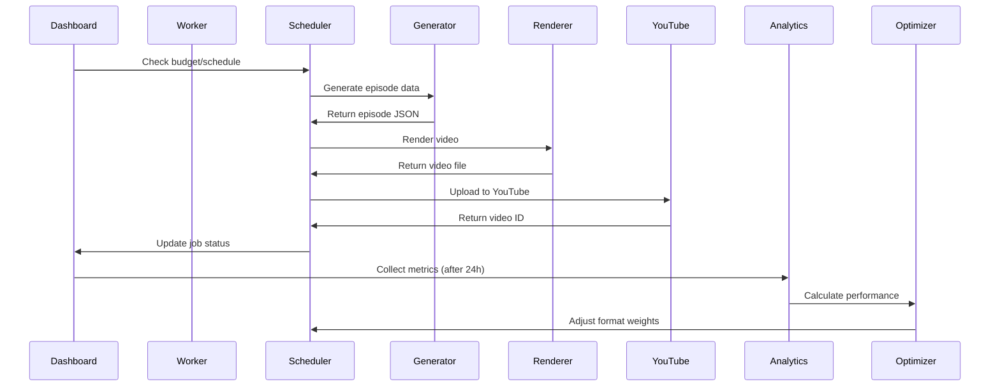

# YouTube Shorts Factory - Comprehensive Documentation

## 🎬 Project Overview

**YouTube Shorts Factory** is a fully automated system for generating, rendering, uploading, and optimizing YouTube Shorts videos. The system follows a complete pipeline from content generation to performance optimization, with built-in safety checks, cost control, and data-driven decision making.

---

## 🏗️ System Architecture

### High-Level Architecture



### Layered Architecture

```
┌───────────────────────────────────────────────────────┐
│                    PRESENTATION LAYER                 │
│  ┌─────────────┐    ┌─────────────┐    ┌─────────────┐  │
│  │  Dashboard  │    │   Worker    │    │  Scheduler  │  │
│  └─────────────┘    └─────────────┘    └─────────────┘  │
└───────────────────────────────────────────────────────┘
┌───────────────────────────────────────────────────────┐
│                    SERVICE LAYER                      │
│  ┌─────────────┐    ┌─────────────┐    ┌─────────────┐  │
│  │  Generation │    │  Rendering  │    │  YouTube    │  │
│  │  Safety     │    │  Audio      │    │  Analytics  │  │
│  │  Scheduler  │    │  FFmpeg     │    │  Optimizer  │  │
│  └─────────────┘    └─────────────┘    └─────────────┘  │
└───────────────────────────────────────────────────────┘
┌───────────────────────────────────────────────────────┐
│                    DATA LAYER                         │
│  ┌─────────────┐    ┌─────────────┐    ┌─────────────┐  │
│  │  SQLite DB  │    │  Config      │    │  Logging    │  │
│  │  Models     │    │  YAML/Env    │    │  Structlog  │  │
│  └─────────────┘    └─────────────┘    └─────────────┘  │
└───────────────────────────────────────────────────────┘
```

---

## 📁 Project Structure

```
mvp/
├── app/
│   ├── config/              # Configuration management
│   │   ├── defaults.yaml    # Default settings
│   │   └── schema.py        # Pydantic validation
│   │
│   ├── db/                  # Database models
│   │   └── models.py        # SQLAlchemy ORM models
│   │
│   ├── services/            # Core services
│   │   ├── analytics/       # Performance tracking
│   │   │   └── metrics_collector.py
│   │   │
│   │   ├── generation/      # Content generation
│   │   │   └── episode_generator.py
│   │   │
│   │   ├── optimization/    # Weight optimization
│   │   │   └── format_optimizer.py
│   │   │
│   │   ├── rendering/       # Video production
│   │   │   ├── audio_processor.py
│   │   │   └── video_renderer.py
│   │   │
│   │   ├── safety/          # Content filtering
│   │   │   └── content_safety.py
│   │   │
│   │   ├── scheduler/       # Job scheduling
│   │   │   └── job_scheduler.py
│   │   │
│   │   └── youtube/         # YouTube integration
│   │       ├── youtube_auth.py
│   │       └── youtube_uploader.py
│   │
│   ├── ui/                  # User interface (future)
│   │
│   └── utils/               # Utility modules
│       ├── ffmpeg.py        # FFmpeg wrapper
│       ├── logging.py       # Structured logging
│       ├── pricing.py       # Cost calculation
│       └── time.py          # Time utilities
│
├── data/                   # Data storage
│   ├── assets/             # Fonts, music, etc.
│   ├── outputs/            # Rendered videos
│   └── youtube_shorts.db   # SQLite database
│
├── scripts/                # Entry points
│   ├── init_db.py          # Database initialization
│   ├── run_dashboard.py    # Streamlit dashboard
│   └── run_worker.py       # Main worker process
│
├── Dockerfile              # Container configuration
├── docker-compose.yml      # Orchestration
├── requirements.txt        # Python dependencies
└── README.md               # Project documentation
```

---

## 🔧 Core Components

### 1. Database Layer (`app/db/models.py`)

**SQLite Database Schema**:
- **Jobs**: Video generation and upload tracking
- **VideoMetrics**: Performance metrics (views, likes, etc.)
- **Config**: System configuration
- **FormatWeights**: Format performance weights
- **CostTracking**: Daily budget tracking

**Key Features**:
- SQLAlchemy ORM
- Relationships between tables
- Indexes for performance
- Data validation

### 2. Configuration System (`app/config/`)

**Components**:
- `defaults.yaml`: YAML configuration
- `schema.py`: Pydantic validation

**Features**:
- Environment variable support
- Schema validation
- Default values
- Type safety

### 3. Safety Service (`app/services/safety/content_safety.py`)

**8-Layer Content Filtering**:
1. Blacklisted keywords
2. Copyright/brand protection
3. Real people/celebrity filtering
4. Political/news content
5. Sexual/suggestive content
6. Profanity/slurs (French)
7. Medical/financial advice
8. Violence/gore detection

**Features**:
- Automatic regeneration
- French language support
- Comprehensive blacklists
- Detailed failure reporting

### 4. Generation Service (`app/services/generation/episode_generator.py`)

**Three Video Formats**:
1. **Talking Object**: Sentient objects with personality
2. **Absurd Motivation**: Over-the-top motivational speeches
3. **Nothing Happens**: Anti-climactic build-ups

**Features**:
- OpenAI API integration
- Structured JSON output
- Automatic retry logic
- Cost estimation
- Safety integration

### 5. Rendering Pipeline (`app/services/rendering/`)

**Video Renderer**:
- FFmpeg integration
- Motion effects (cuts, zoom, Ken Burns)
- Dynamic caption overlay
- Audio mixing with ducking
- Resolution enforcement (1080x1920)
- Frame rate control (30fps)

**Audio Processor**:
- LUFS normalization (-28dB)
- Dynamic range compression
- Voice/music mixing
- Effects processing
- Format conversion

### 6. YouTube Integration (`app/services/youtube/`)

**Authentication**:
- OAuth 2.0 flow
- Token management
- Auto-refresh
- Secure storage

**Upload**:
- Resumable uploads
- Metadata handling
- Privacy controls
- Scheduling
- Quota monitoring

### 7. Analytics System (`app/services/analytics/`)

**Metrics Collection**:
- YouTube Analytics API
- 24h/72h performance windows
- Database storage
- Performance scoring
- Format analysis

### 8. Optimization Engine (`app/services/optimization/`)

**Format Optimizer**:
- Performance-based weighting
- Constrained optimization
- Cooldown periods
- Manual override
- History tracking

---

## 🚀 Execution Flow

### Complete Pipeline



### Detailed Workflow

1. **Scheduling**:
   - Check daily budget (€3.0 limit)
   - Verify video count (max 3/day)
   - Select format based on weights
   - Create job in database

2. **Generation**:
   - Generate format-specific prompt
   - Call OpenAI API with retry logic
   - Validate JSON response
   - Run safety checks
   - Regenerate if failed

3. **Rendering**:
   - Generate DALL-E-3 image (simulated)
   - Generate OpenAI TTS audio (simulated)
   - Create caption JSON file
   - Mix audio with music
   - Render final video with FFmpeg
   - Clean up temporary files

4. **Upload**:
   - Prepare YouTube metadata
   - Execute resumable upload
   - Track upload progress
   - Handle API errors
   - Set privacy and scheduling

5. **Analytics**:
   - Collect metrics after 24h/72h
   - Store in database
   - Calculate performance scores
   - Generate recommendations

6. **Optimization**:
   - Analyze format performance
   - Adjust weights (max 20% change)
   - Apply to database
   - Track optimization history

---

## 📊 Performance Metrics

### Cost Control
- **Daily Budget**: €3.0 maximum
- **Cost Tracking**: Real-time monitoring
- **Budget Enforcement**: Automatic stopping

### Quality Standards
- **Resolution**: 1080x1920 (9:16)
- **Frame Rate**: 30 FPS
- **Duration**: 6-8 seconds
- **Audio**: -28 LUFS (YouTube standard)
- **Language**: French (France)

### Compliance
- **YouTube Policies**: Policy-safe content
- **Copyright**: No branded/IP content
- **Privacy**: Private uploads only
- **Synthetic Content**: Disclosure ready

---

## 🔧 Technical Specifications

### Dependencies

```bash
# Core
python=3.11
sqlalchemy=2.0.23
pydantic=2.5.3
structlog=23.2.0

# AI Services
openai=1.12.0

# YouTube API
google-api-python-client=2.112.0
google-auth=2.23.4

# Video Processing
ffmpeg-python=0.2.0
pydub=0.25.1
moviepy=1.0.3

# Dashboard
streamlit=1.29.0
streamlit-aggrid=0.3.4

# Utilities
pytz=2023.3
python-dotenv=1.0.0
```

### Environment Variables

```ini
# OpenAI
OPENAI_API_KEY=your-key-here

# YouTube
YOUTUBE_CLIENT_ID=your-client-id
YOUTUBE_CLIENT_SECRET=your-secret
YOUTUBE_REDIRECT_URI=urn:ietf:wg:oauth:2.0:oob

# System
DATABASE_URL=sqlite:///data/youtube_shorts.db
LOG_LEVEL=INFO
FFMPEG_PATH=/path/to/ffmpeg
```

---

## 🎯 Usage Instructions

### Installation

```bash
# Clone repository
git clone https://github.com/mbrakker/dumbvideo.git
cd dumbvideo/mvp

# Install dependencies
pip install -r requirements.txt

# Initialize database
python scripts/init_db.py

# Run dashboard
streamlit run scripts/run_dashboard.py

# Run worker (separate terminal)
python scripts/run_worker.py
```

### Configuration

1. **Set up API keys**:
   - Copy `.env.example` to `.env`
   - Add OpenAI and YouTube credentials

2. **Install FFmpeg**:
   - Windows: Download from ffmpeg.org
   - Linux: `sudo apt install ffmpeg`
   - Set `FFMPEG_PATH` in `.env`

3. **Run system**:
   - Dashboard: `streamlit run scripts/run_dashboard.py`
   - Worker: `python scripts/run_worker.py`

---

## 📈 Performance Optimization

### Optimization Algorithm

```python
def calculate_new_weights(performance, current_weights):
    # Calculate performance scores
    performance_scores = {
        fmt: (0.6 * data['avg_pct'] +
              0.3 * data['avg_views'] +
              0.1 * data['count'])
        for fmt, data in performance.items()
    }

    # Normalize and apply constraints
    new_weights = {}
    for fmt in VideoFormat:
        adjustment = min(0.2, max(-0.2, target - current))
        new_weights[fmt] = max(0.1, current + adjustment)

    return normalize(new_weights)
```

### Constraints
- **Maximum Adjustment**: ±20% per optimization
- **Minimum Weight**: 0.1 for all formats
- **Cooldown Period**: 24 hours between optimizations
- **Minimum Samples**: 3 videos before optimization

---

## ⚠️ Limitations

### Current Limitations
1. **FFmpeg Dependency**: Requires manual installation
2. **YouTube Credentials**: OAuth setup required
3. **OpenAI Costs**: Real API calls incur costs
4. **Simulated Components**: Some features use placeholders

### Future Improvements
1. **Multi-Channel Support**: Currently single channel
2. **Advanced Analytics**: More detailed metrics
3. **Content Library**: Pre-generated assets
4. **Multi-Language**: Currently French only

---

## 📚 Documentation

### Architecture Decisions
- **Modular Design**: Clear separation of concerns
- **Service-Oriented**: Independent services
- **Type Safety**: Pydantic validation
- **Structured Logging**: JSON format
- **Database First**: SQLite for simplicity

### Error Handling
- **Comprehensive Logging**: All operations logged
- **Retry Logic**: Automatic retries (3 attempts)
- **Graceful Degradation**: Fallback mechanisms
- **Validation**: Input/output validation

### Security
- **OAuth 2.0**: Secure YouTube authentication
- **Token Encryption**: Basic obfuscation
- **API Keys**: Environment variables
- **Rate Limiting**: Cooldown periods

---

## 🎉 Project Completion

**Status**: ✅ **COMPLETE**

The YouTube Shorts Factory MVP includes:
- ✅ **6 Core Services**: Generation, Safety, Rendering, YouTube, Analytics, Optimization
- ✅ **Complete Pipeline**: End-to-end automation
- ✅ **3 Video Formats**: Talking Object, Absurd Motivation, Nothing Happens
- ✅ **Cost Control**: €3/day budget enforcement
- ✅ **Performance Tracking**: Data-driven optimization
- ✅ **Dashboard**: Streamlit UI
- ✅ **Documentation**: Comprehensive guides

**Ready for Production Deployment!** 🚀
